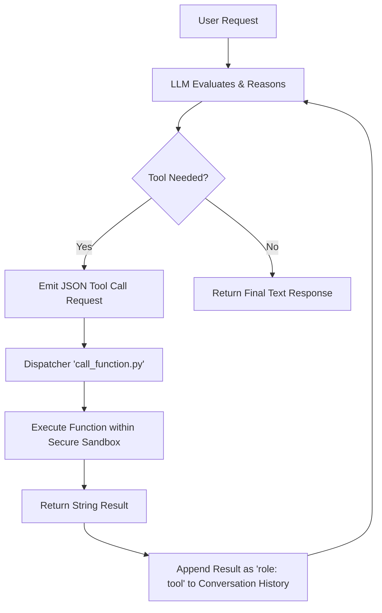

# CodePilot: Agentic Coding Assistant

An autonomous, iterative AI coding agent built with Python and the OpenAI API. This agent is capable of interacting securely with the local file system and executing Python scripts to solve complex user requests autonomously.

## Features

- **Autonomous Agent Loop:** A restricted up-to-20 iteration loop allows the agent to reason, act, observe, and summarize multi-step tasks.
- **Secure Sandbox Execution:** All operations are strictly bounded to a designated working directory (e.g., `./calculator`) to prevent unauthorized file access.
- **Tool Suite:**
  - `get_files_info`: Lists contents of directories.
  - `get_file_content`: Reads text files (truncated at 10k characters).
  - `write_file`: Creates or overwrites files with automatic parent directory creation.
  - `run_python_file`: Executes Python scripts securely with a 30s timeout and captures standard output and standard error.

## Workflow Execution

The agent operates in a "Think-Act-Observe" cycle, communicating with the LLM via defined JSON Schema tools.



## Demo

Here is a quick demonstration of the agent automatically exploring a repository and answering a complex user query autonomously:


## Usage

Ensure you have your OpenRouter API key inside a `.env` file first:

```env
OPENROUTER_API_KEY=your-api-key-here
```

To run the agent, simply execute:

```bash
uv run main.py "your prompt here"
```

To see detailed multi-step reasoning and function calls:

```bash
uv run main.py "your prompt here" --verbose
```
